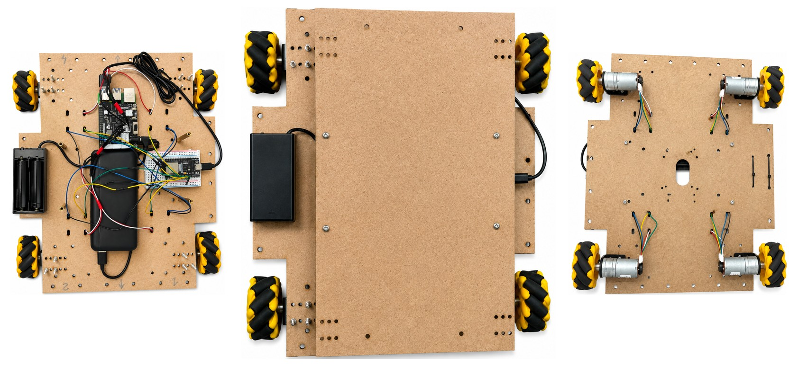
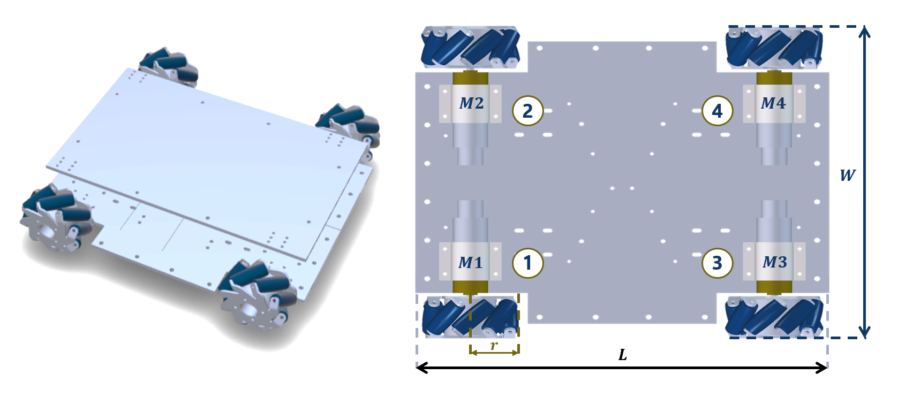
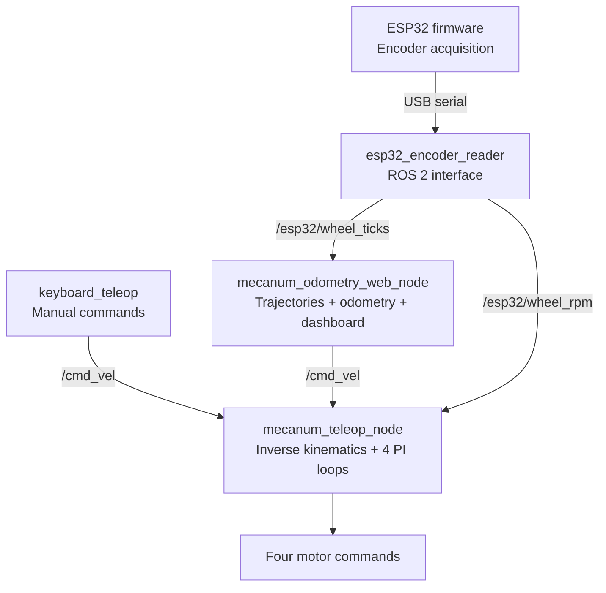
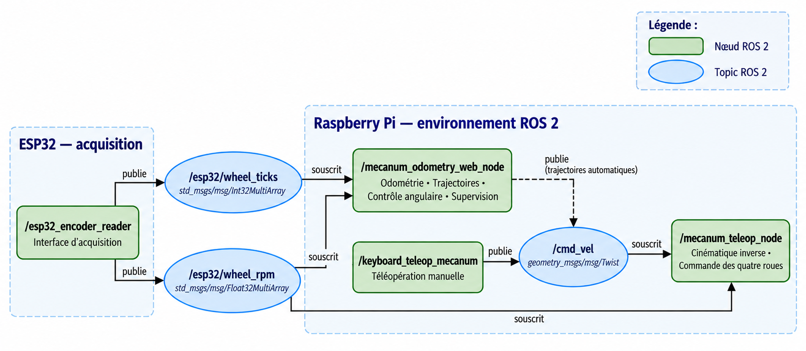
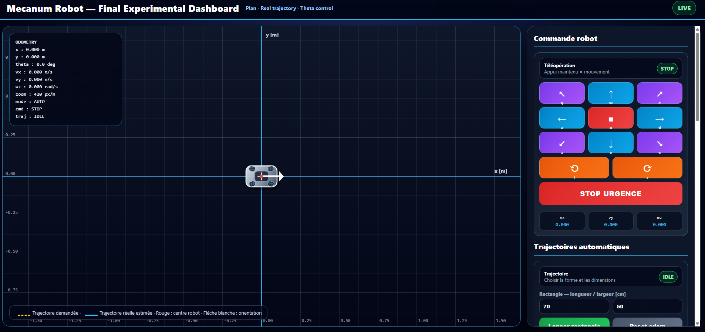
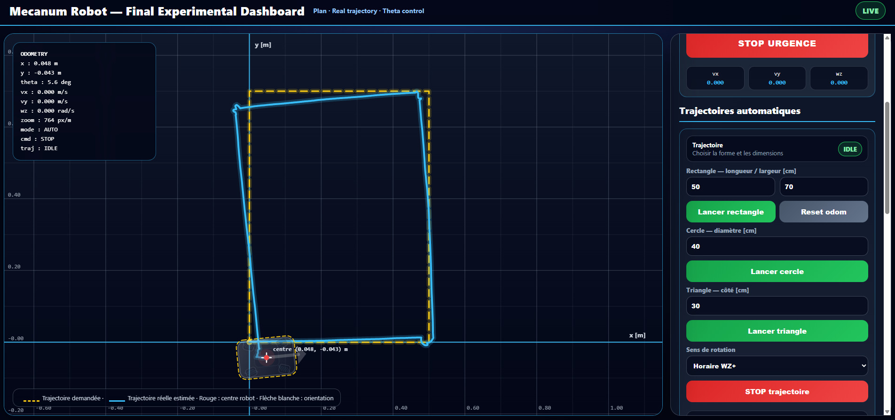
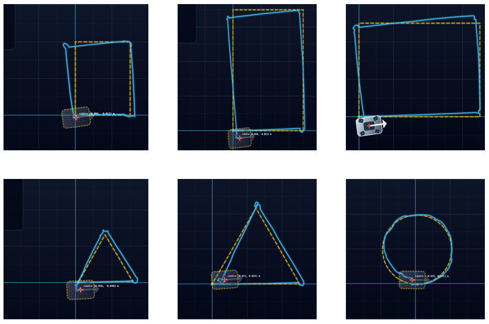

<div align="center">

# Distributed ROS 2 Control Architecture for a Four-Wheel Mecanum Mobile Robot

### Design, implementation, and experimental validation on a real omnidirectional platform

[](https://docs.ros.org/)


**[▶ View the complete experimental demonstration](https://github.com/MohamedAliMaghrebi/ros2-mecanum-mobile-robot/releases/tag/v1.0.0)**

<br>

<a href="https://github.com/MohamedAliMaghrebi/ros2-mecanum-mobile-robot/releases/tag/v1.0.0">
  
</a>

*Real four-wheel Mecanum platform developed for experimental validation.*

</div>

---

## Project Highlights

- **Real experimental platform** with four independently actuated Mecanum wheels.
- **Distributed embedded architecture** combining a Raspberry Pi and an ESP32.
- **ROS 2 modular implementation** built around four specialized nodes.
- **Four independent PI wheel-speed controllers** with feedforward compensation, saturation, and anti-windup.
- **Encoder-based odometry**, automatic trajectory generation, angular correction, and web supervision.
- **Six experimentally validated closed trajectories** using one common controller configuration.
- **Full experimental traceability** through synchronized CSV logging at 50 Hz.

## Experimental Demonstration

The complete video documents the physical platform, the ROS 2 control architecture, the web-based dashboard, and the execution of rectangular, triangular, and circular trajectories.

### [Open Experimental Demonstration — Release v1.0.0](https://github.com/MohamedAliMaghrebi/ros2-mecanum-mobile-robot/releases/tag/v1.0.0)

**Video asset:** `experimental-demonstration-ros2-mecanum-robot.mp4`

---

## System Overview

The robot uses four Mecanum wheels to generate longitudinal translation, lateral translation, rotation, and combined planar motions. The architecture separates time-sensitive encoder acquisition from control, trajectory generation, odometry, supervision, and experimental recording.

<div align="center">
  
  <br>
  <em>Mechanical platform, wheel configuration, and geometric parameters.</em>
</div>

### Hardware configuration

| Component | Function |
|---|---|
| Raspberry Pi | ROS 2 execution, control, trajectory generation, odometry, logging, and supervision |
| ESP32-WROOM | Quadrature-encoder counting, wheel-speed computation, filtering, and serial transmission |
| Four DC motors | Independent actuation of the four Mecanum wheels |
| Quadrature encoders | Wheel-speed and cumulative tick measurements |
| Motor power interface | PWM and direction commands for the four motors |
| Web dashboard | Teleoperation, trajectory execution, monitoring, reset, and emergency stop |

### Main physical and control parameters

| Parameter | Value |
|---|---:|
| Wheel radius | 0.0325 m |
| Longitudinal half-dimension, `a` | 0.175 m |
| Transverse half-dimension, `b` | 0.115 m |
| Encoder resolution | 468 ticks/revolution |
| Control frequency | 50 Hz |
| Odometry update frequency | 50 Hz |
| Serial communication | 115200 bit/s |
| PI gains | Kp = 0.35, Ki = 0.45 |
| PWM saturation | ±30 |
| Angular tolerance | ±1° |

---

## Distributed Software Architecture

The final implementation uses one ESP32 firmware and four main ROS 2 nodes on the Raspberry Pi.



### Software modules

| Platform | Module | Main responsibility |
|---|---|---|
| ESP32 | `esp32_encoder_acquisition.ino` | Quadrature counting, RPM calculation, exponential filtering, and serial transmission |
| Raspberry Pi | `keyboard_teleop.py` | Manual motion-command generation |
| Raspberry Pi | `mecanum_teleop_node.py` | Inverse kinematics, feedforward action, four PI loops, saturation, and motor commands |
| Raspberry Pi | `esp32_encoder_reader.py` | Serial interface and publication of wheel RPM and cumulative ticks |
| Raspberry Pi | `mecanum_odometry_web_node.py` | Direct kinematics, calibrated odometry, trajectories, angular control, web supervision, and CSV logging |

### Principal ROS 2 topics

| Topic | Message type | Information |
|---|---|---|
| `/cmd_vel` | `geometry_msgs/msg/Twist` | Chassis motion command |
| `/esp32/wheel_rpm` | `std_msgs/msg/Float32MultiArray` | Measured speeds of the four wheels |
| `/esp32/wheel_ticks` | `std_msgs/msg/Int32MultiArray` | Cumulative encoder counts |

<div align="center">
  
  <br>
  <em>Functional ROS 2 architecture and principal data exchanges.</em>
</div>

---

## Control Architecture

For a chassis command `[vx, vy, wz]`, inverse kinematics generates four wheel-speed references. Each wheel is regulated independently using a feedforward-plus-PI law:

```text
wheel reference → feedforward + PI correction → saturation → PWM command
                         ↑                         |
                         └──── measured speed ─────┘
```

The implementation includes:

- experimentally identified feedforward compensation;
- independent proportional-integral correction for each wheel;
- integral anti-windup;
- PWM limitation to ±30;
- multirate use of the latest available encoder measurement;
- calibrated longitudinal, transverse, and angular odometry;
- two-stage angular approach with a ±1° termination tolerance.

---

## Web-Based Supervision

<div align="center">
  
  <br>
  <em>Interface for teleoperation, automatic trajectories, pose visualization, monitoring, reset, and emergency stop.</em>
</div>

The dashboard provides:

- manual omnidirectional teleoperation;
- automatic rectangle, triangle, and circle generation;
- real-time visualization of estimated pose and trajectory;
- wheel-speed and chassis-state monitoring;
- odometry and display reset functions;
- trajectory interruption and emergency stop;
- synchronized experimental recording.

---

## Experimental Validation

A single controller configuration was retained for the entire campaign. Six closed trajectories were executed on the real robot:

| Test | Geometry | Main solicitation |
|---|---:|---|
| R1 | Rectangle 30 × 40 cm | Translations and 90° rotations |
| R2 | Rectangle 50 × 70 cm | Translations and 90° rotations |
| R3 | Rectangle 70 × 50 cm | Translations and 90° rotations |
| T1 | Equilateral triangle, 30 cm side | Translations and 120° rotations |
| T2 | Equilateral triangle, 50 cm side | Translations and 120° rotations |
| C1 | Circle, 40 cm diameter | Simultaneous translation and rotation |

<div align="center">
  
  <br>
  <em>Execution and supervision of the representative 50 × 70 cm rectangular trajectory.</em>
</div>

### Quantitative results

| Trajectory | Global MAE (RPM) | Maximum error (RPM) | Maximum command | Estimated odometric closure (m) | Final estimated orientation |
|---|---:|---:|---:|---:|---:|
| Rectangle 30 × 40 cm | 2.86 | 11.02 | 22 | 0.014 | 7.7° |
| Rectangle 50 × 70 cm | 2.35 | 10.95 | 22 | 0.064 | 5.6° |
| Rectangle 70 × 50 cm | **2.34** | **10.90** | 23 | 0.077 | 7.7° |
| Triangle, 30 cm side | 3.74 | 10.93 | 22 | 0.049 | 3.1° |
| Triangle, 50 cm side | 2.98 | 10.90 | 22 | 0.076 | 4.4° |
| Circle, 40 cm diameter | 4.82 | 17.90 | 25 | 0.028 | **−0.4°** |

### Key findings

- The five polygonal trajectories achieved global MAE values between **2.34 and 3.74 RPM**.
- The circular trajectory was the most demanding scenario, with a global MAE of **4.82 RPM**.
- No actuator saturation was observed: the highest command was **25**, compared with a limit of **±30**.
- The same controller configuration supported sequential translations, discrete rotations, and continuous combined motion.
- Encoder-only odometry preserved the global trajectory geometry while revealing the expected cumulative effects of Mecanum-wheel slip.

<div align="center">
  
  <br>
  <em>Reference paths and encoder-based odometric reconstructions for the six experimental scenarios.</em>
</div>

> **Interpretation note:** the closure and final-orientation values are internal odometric consistency indicators. They are not absolute positioning errors because no independent external localization reference was used.

---

## Repository Structure

```text
ros2-mecanum-mobile-robot/
├── README.md
├── LICENSE
├── CITATION.cff
├── .gitignore
├── software/
│   ├── esp32/
│   │   └── esp32_encoder_acquisition.ino
│   └── raspberry_pi/
│       ├── keyboard_teleop.py
│       ├── mecanum_teleop_node.py
│       ├── esp32_encoder_reader.py
│       └── mecanum_odometry_web_node.py
├── config/
│   └── robot_parameters.yaml
├── analysis/
│   └── figure_generation/
├── data/
│   └── README.md
└── docs/
    └── images/
        ├── hero-platform.jpg
        ├── platform-and-geometry.png
        ├── ros2-architecture.png
        ├── web-dashboard.png
        ├── real-experiment-50x70.jpg
        └── six-trajectory-comparison.png
```

The complete raw experimental CSV files may be provided separately because they contain high-frequency logs for the six validation scenarios.

---

## Getting Started

### Requirements

- ROS 2 on Linux;
- Python 3;
- Raspberry Pi with a USB serial connection to the ESP32;
- ESP32 firmware flashed with the encoder-acquisition program;
- four-wheel Mecanum mobile platform and compatible motor-power interface.

### Execution order

```bash
# 1. Start the ESP32 serial interface
python3 software/raspberry_pi/esp32_encoder_reader.py

# 2. Start wheel control
python3 software/raspberry_pi/mecanum_teleop_node.py

# 3. Start odometry, trajectories, and web supervision
python3 software/raspberry_pi/mecanum_odometry_web_node.py

# 4. Optional manual teleoperation
python3 software/raspberry_pi/keyboard_teleop.py
```

> Adapt the serial port, GPIO configuration, and launch procedure to the target Raspberry Pi and motor interface before execution.

---

## Academic Context

| Field | Information |
|---|---|
| Author | **Mohamed Ali Maghrebi** |
| Degree | Master of Applied Science (M.Sc.A.) in Engineering |
| Institution | Université du Québec à Rimouski (UQAR) |
| Research supervisor | Prof. Tan Sy Nguyen |
| Research areas | Mobile robotics, ROS 2, embedded systems, mechatronics, and control |
| Year | 2026 |

## Citation

If you use or refer to this work, please cite:

> M. A. Maghrebi, “Design, Implementation, and Experimental Validation of a Distributed ROS 2 Control Architecture for a Four-Wheel Mecanum Mobile Robot,” Master's thesis, Université du Québec à Rimouski, Rimouski, QC, Canada, 2026.

## License

Source code is distributed under the [MIT License](LICENSE). Photographs, diagrams, experimental results, thesis content, and video materials remain attributed to Mohamed Ali Maghrebi unless otherwise specified.

---

<div align="center">

### Mohamed Ali Maghrebi

**ROS 2 · Mobile Robotics · Mecanum Wheels · Embedded Control · Experimental Validation**

**[Experimental video](https://github.com/MohamedAliMaghrebi/ros2-mecanum-mobile-robot/releases/tag/v1.0.0)** · **[Repository](https://github.com/MohamedAliMaghrebi/ros2-mecanum-mobile-robot)**

</div>
